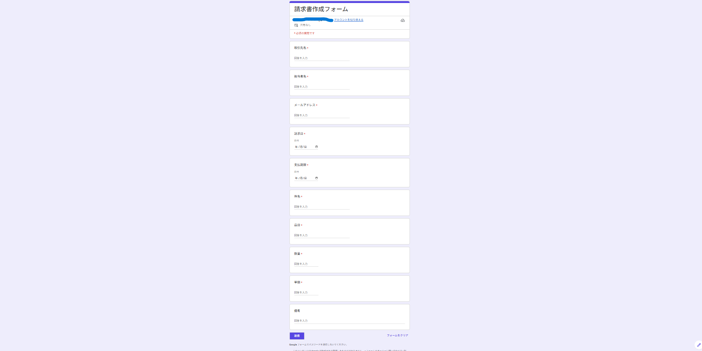
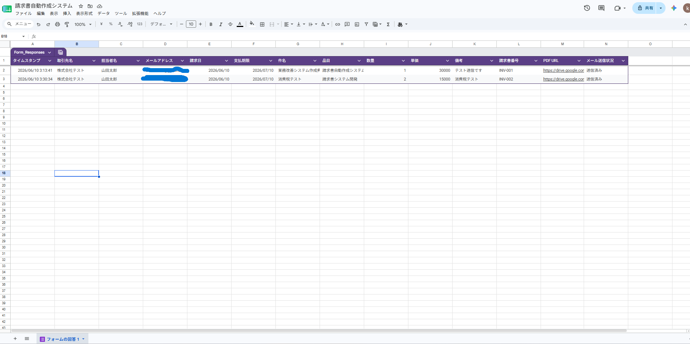
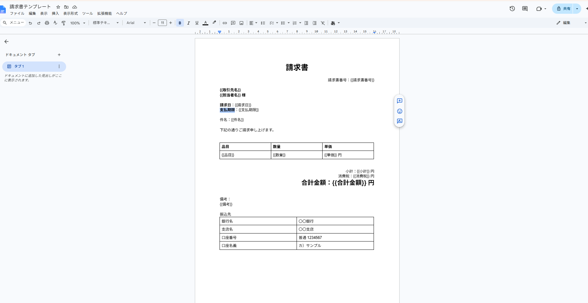
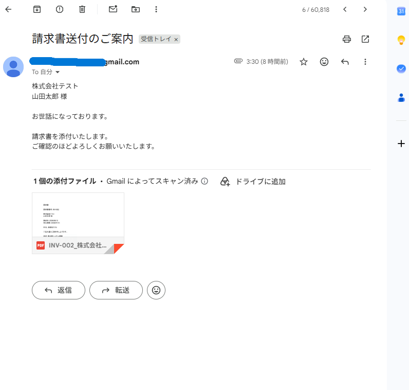

# 請求書自動作成システム

Google Forms・Google Sheets・Google Apps Script（GAS）を活用して作成した請求書自動作成システムです。

## 概要

フォームから入力された請求情報をもとに、

* 請求書番号自動採番
* 消費税自動計算
* PDF請求書自動生成
* Gmail自動送信

を実現しています。

## 使用技術

* Google Forms
* Google Sheets
* Google Apps Script（GAS）
* Google Docs
* Google Drive
* Gmail

## 主な機能

### 請求情報登録

Googleフォームから請求情報を登録

### 請求書番号自動採番

INV-001

INV-002

INV-003

の形式で自動採番

### 消費税自動計算

小計

↓

消費税（10%）

↓

合計金額

を自動計算

### PDF自動生成

GoogleドキュメントテンプレートからPDFを自動生成

### メール自動送信

生成したPDFをGmailで自動送信

### 送信状況管理

スプレッドシート上で送信状況を管理

## システム構成

Google Forms

↓

Google Sheets

↓

Google Apps Script

↓

Google Docs

↓

PDF生成

↓

Gmail送信

## スクリーンショット

### フォーム画面

### 管理画面

### PDF請求書

### Gmail送信

## 学んだこと

* Googleドキュメント操作
* PDF生成処理
* Gmail自動送信
* Drive操作
* 消費税計算ロジック
* 業務自動化フロー構築

## 今後の改善

* 見積書対応
* 複数品目対応
* 送信履歴管理
* インボイス制度対応
